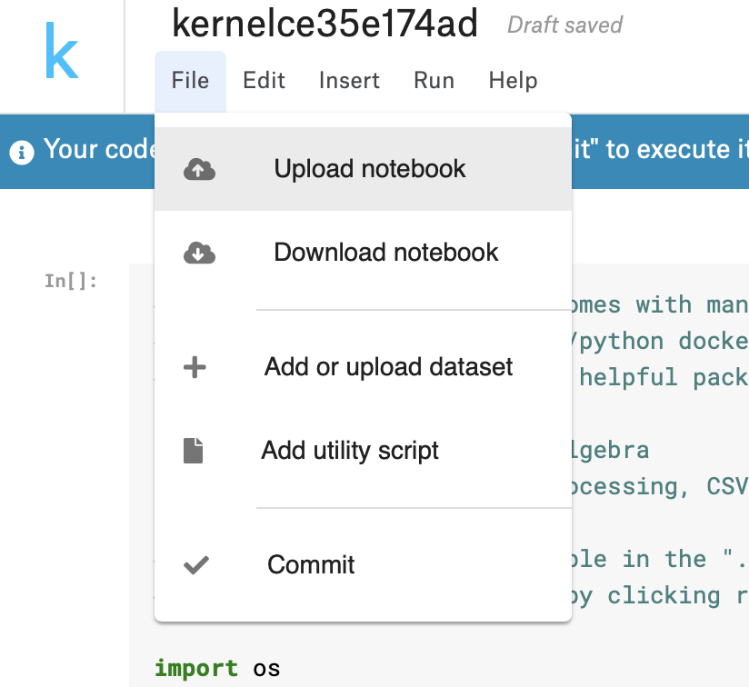
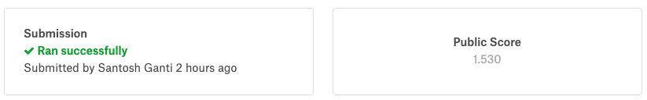
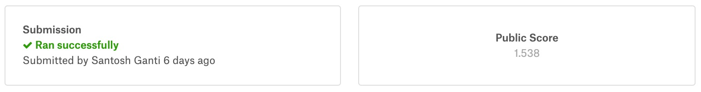

This is a project worked on by Sai Santosh Kumar Ganti, Abhishek Rai Sharma, Mohit, and Vijay Karigowadara as part of BU CAS CS 542. 

Below are the instructions on how to run the code and see the results. 

The data for this project is provided by Kaggle. Please go ahead to this page for more information on the competetion we entered - https://www.kaggle.com/c/LANL-Earthquake-Prediction

The data itself is so big that it's not possible to provide it over GitHub or zip file. So, we will make use of Kaggle environment and the kernels provided by them. Kaggle kernels are just iPython notebook running on a cloud python environment provided by Kaggle.

We have provided the code in the form of iPython notebook. Please download the notebook provided and to recreate the project please set up an account on Kaggle, register for this competetion and upload this notebook in a kernel at Kaggle. Alternatively, if you can download the data provided by kaggle, you can use environment of your choice to run this notebook. 

We will provide our report and iPython Notebook for reference and you can find them in the repository.

Goto new kernel as shown in the image below

Upload the new notbook once you create a jupyter notebook based kernel. 

You should now be able to run the code provided by us. 

Below are the results we got 

This is the mean absolute error with statistical features 

This is the mean absolute error with statistical features and signal processing features

Please let us know if you have any questions. 

Thanks
